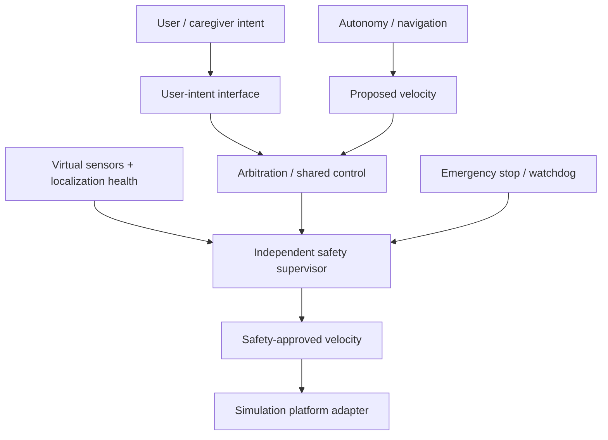

# CAREC

## Open-source, simulation-first ROS 2 autonomous wheelchair engineering


CAREC develops transparent, testable technology for safer and more independent powered-wheelchair mobility while preserving user control. The current engineering focus is a **simulation-first ROS 2 autonomy stack**: digital wheelchair modeling, manual and shared control, localization, navigation, perception, deterministic safety supervision, and reproducible scenario testing.

> **Current phase: CAREC Sim foundation.** CAREC is not a medical device, is not certified for clinical use, and does not currently provide validated autonomous wheelchair operation. Simulation results are not evidence of physical-wheelchair safety.

## Current architecture direction



The simulator and future physical platform adapters must consume only safety-approved motion. Raw planner, AI, or user commands must never bypass the safety boundary.

## Simulation-first stack

- Ubuntu 24.04 reference environment
- ROS 2 Jazzy
- Gazebo / `ros_gz` simulation
- RViz2
- Nav2 and standard ROS 2 localization/mapping tools
- Python and C++
- Docker / Dev Containers
- GitHub Actions
- deterministic evaluation and fault-injection scenarios

Physical wheelchair hardware is **not required** for the current milestone.

## Current milestone

**CAREC Sim 0.1:** launch a digital wheelchair in an indoor environment, drive it manually, navigate to a destination autonomously, enforce independent safety limits, handle faults safely, record telemetry, and produce reproducible evidence.

Execution is tracked in GitHub Issues. Architecture decisions are recorded as ADRs before implementation.

## Quick start

```bash
git clone <repository-url>
cd CAREC-Project
./scripts/bootstrap.sh --check
python3 -m pytest tests/unit -v
```

Then read [Getting Started](docs/08-contributors/getting-started.md), select a ready GitHub issue, create a branch, and submit a pull request. Do not commit feature work directly to `main`.

## Repository navigation

| Area | Purpose |
|---|---|
| [`docs/`](docs/README.md) | Requirements, architecture, simulation, safety, testing, ADRs, and contributor guidance |
| [`autonomy_ws/`](autonomy_ws/README.md) | ROS 2 autonomy workspace and simulation foundation |
| [`simulation/`](simulation/README.md) | Simulator models, environments, sensors, scenarios, and tests |
| [`software/`](software/README.md) | ROS 2 navigation, perception, AI, fusion, and shared-control software |
| [`tests/`](tests/README.md) | Simulation and autonomy tests |
| [`hardware/`](hardware/README.md) | Future physical-integration boundary only; not part of current development milestone |
| [`.github/`](.github) | Issues, pull-request workflow, ownership, and CI |

## Source of truth and synchronization

GitHub `main` is the engineering source of truth. GitHub Issues track execution. GitBook publishes approved documentation from `main`. README files link to canonical status rather than maintaining independent milestone claims. Discord is coordination-only and must link back to GitHub/GitBook records.

Canonical status:
- [`evaluation/status.json`](evaluation/status.json) — machine-readable state
- [`docs/status/PROJECT_SCORECARD.md`](docs/status/PROJECT_SCORECARD.md) — human-readable status/evidence
- [`docs/11-decisions/`](docs/11-decisions/) — architecture decisions
- [GitHub Issues](https://github.com/vinodkumar1947/CAREC-Project/issues) — work execution
- [Published GitBook](https://carec.gitbook.io/carec-docs) — approved documentation

Contributions are welcome from engineers, researchers, accessibility specialists, clinicians, caregivers, wheelchair users, technical writers, and testers. Read [CONTRIBUTING.md](CONTRIBUTING.md) and the [Code of Conduct](CODE_OF_CONDUCT.md).
