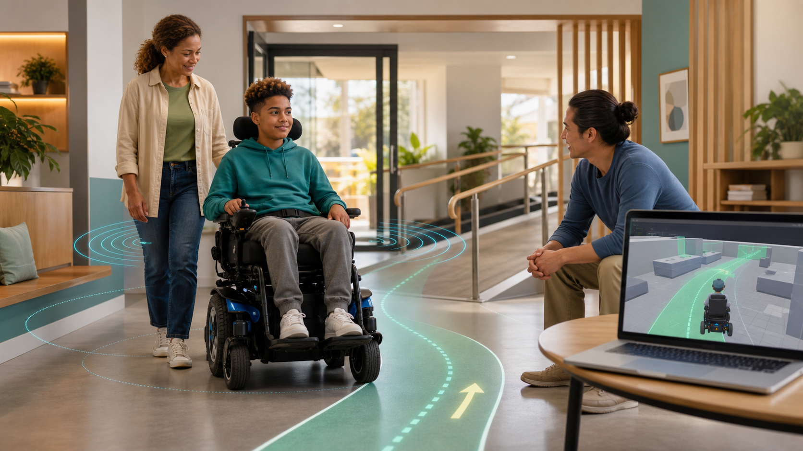

# CAREC

## Open-source, simulation-first assistive mobility research



CAREC is building reusable software for safer powered-wheelchair mobility. Our long-term aim is supervised navigation and shared control: the user remains in command while software helps detect hazards, limit unsafe motion, and navigate accessible indoor spaces.

The project is developed in simulation first. Contributors do not need a wheelchair, sensors, embedded boards, or a GPU. Physical integration is isolated behind reviewed, wheelchair-specific adapters and is performed only by the project owner on a controlled prototype.

> **Current maturity: research prototype.** CAREC is not a medical device, is not approved for unsupervised use, and must not be connected to wheelchair motors from community builds.

## Why CAREC exists

For wheelchair users, families, therapists, and clinicians, CAREC explores whether open engineering can provide:

- earlier awareness of obstacles and unsafe conditions;
- shared control that respects the user's intent;
- supervised navigation through homes, schools, and care environments;
- transparent safety behavior that can be tested and discussed;
- adaptable software rather than dependence on one wheelchair manufacturer.

For engineers, CAREC provides a reproducible robotics platform for perception, localization, navigation, human-machine interaction, simulation, and safety testing.

## What we mean by compatibility

There is no universal wheelchair motor or joystick interface. CAREC therefore separates the software into layers:

```text
User input or supervised autonomy
               |
        Navigation controller
               |
      Independent safety supervisor
               |
       Standard safe-motion interface
               |
  Simulator adapter or owner-only hardware adapter
```

The core can be platform-agnostic. Each physical wheelchair model still requires an individually reviewed adapter, configuration, and validation. Manual wheelchairs require a separate powered drive system and are not made autonomous by software alone.

## Planned capability levels

| Level | Capability | Contributor hardware |
|---|---|---|
| L0 | Obstacle warning research | None for most tasks |
| L1 | Independent collision monitoring and safe stop | None |
| L2 | Shared control: user drives, software limits unsafe motion | None |
| L3 | Supervised indoor point-to-point navigation | None |
| L4 | Advanced indoor navigation and safe recovery research | None |
| Physical validation | One approved wheelchair-specific prototype | Project owner only |

L2 shared control is the first major product objective. Full unattended autonomy is not an initial claim or release target.

## Current status

The repository contains an earlier SenseCAP Watcher obstacle-warning firmware prototype. It detects supported object classes, estimates approximate distance from bounding boxes, and produces visual/audio/BLE alerts. This code is useful research input, but it is not motor-control software and has unresolved validation work.

The simulation-first autonomy workspace has not yet been implemented. The current program begins with repository governance, reproducible setup, a digital wheelchair, and an independent safety kernel.

See the evidence-based [project scorecard](docs/status/PROJECT_SCORECARD.md), [roadmap](ROADMAP.md), and [project log](PROJECT_LOG.md).

## Software direction

The no-cost core stack is:

- Ubuntu 24.04 LTS;
- ROS 2 Jazzy;
- Gazebo Harmonic;
- Nav2, RViz2, SLAM Toolbox, and rosbag2;
- C++ for runtime and safety components;
- Python for tooling, experiments, metrics, and tests;
- CPU-first simulation, with optional GPU backends later;
- GitHub Issues, Projects, Actions, and Pages for collaboration and reporting.

NVIDIA Isaac Sim and CARLA may become optional high-fidelity backends. They will not be required for normal contributions.

## Repository map

```text
firmware/       Existing obstacle-warning firmware prototype
tests/          Existing host-side firmware behavior tests
autonomy_ws/    ROS 2 autonomy workspace (foundation stage)
evaluation/     Machine-readable progress and future scenario evidence
scripts/        Contributor bootstrap and repository validation
docs/           Vision, architecture, safety, status, and guides
hardware/       Owner-managed prototype documentation
research/       Research writing and references
.github/        Contribution forms, ownership, and CI
```

Planned additions include simulation packages, scenario libraries, evaluation reports, and an owner-controlled `hardware_bridge/`.

The initial contributor environment is available through [the development container](.devcontainer/devcontainer.json). After opening the repository in the container, run:

```bash
./scripts/bootstrap.sh --check
```

## Contributing

The initial contributor cohort is a distributed team of ten early-career engineers. Work is asynchronous and organized as small, testable GitHub issues. No direct push to `main` is expected; every change uses a short-lived branch and pull request.

Start with:

1. [Project aim and boundaries](docs/vision/PROJECT_AIM.md)
2. [First contribution guide](docs/contributors/FIRST_CONTRIBUTION.md)
3. [Team workflow](docs/contributors/TEAM_WORKFLOW.md)
4. [Contribution policy](CONTRIBUTING.md)
5. [Architecture](docs/architecture/AUTONOMY_ARCHITECTURE.md)

Community code may propose motion commands but may never bypass the safety supervisor or directly communicate with physical motors.

## Governance and access

Vinod Kumar is the repository owner, product owner, release authority, and sole physical-hardware integrator. Selected contributors may receive limited repository access. Non-safety reviews can be delegated; safety-critical merges, releases, and hardware enablement remain owner-controlled.

Contributions are accepted under the repository license. Repository ownership does not automatically transfer a contributor's copyright; see [CONTRIBUTING.md](CONTRIBUTING.md) before submitting substantial work.

## License

CAREC is licensed under the [MIT License](LICENSE). This license permits research and development but provides no warranty or medical certification.
