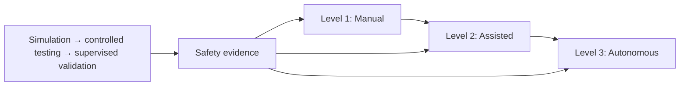
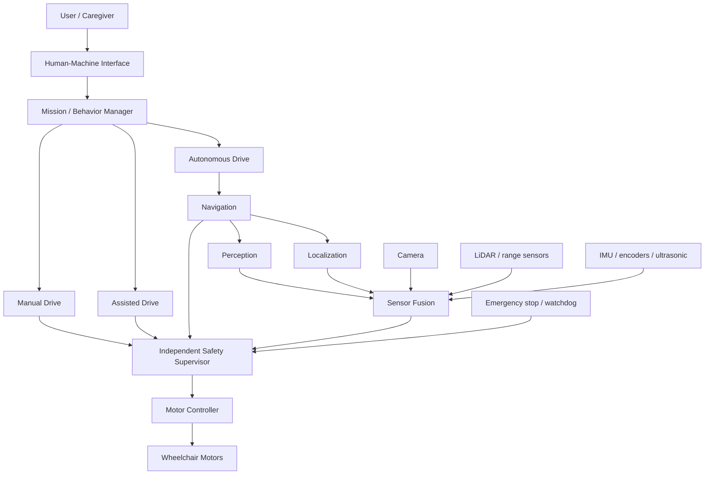

# CAREC

## Open-source, simulation-first intelligent wheelchair engineering


CAREC’s mission is to develop transparent, testable technology that can make powered-wheelchair mobility safer and more independent while preserving user control. It addresses the limited availability of adaptable, openly engineered assistance for obstacle awareness, shared control, and indoor navigation.

> **Current phase: early-stage research and simulation foundation.** CAREC is not a medical device, is not certified for clinical use, and does not currently provide validated autonomous wheelchair operation. Community builds must not be connected to an occupied wheelchair.

## Vision and capability evolution

CAREC is intended to progress incrementally:

| Level | Mode | Intent |
|---|---|---|
| 1 | Manual drive | The user commands motion. Monitoring may trigger only explicitly specified safety intervention. |
| 2 | Assisted drive | Collision avoidance, speed limiting, edge detection, doorway assistance, path correction, and safe stop support the user. |
| 3 | Autonomous drive | Human-supervised indoor mapping, localization, route planning, dynamic avoidance, and destination commands. |



Autonomous mobility is safety-critical. Each capability must earn promotion through simulation, controlled testing, hardware-in-the-loop evidence, and human-supervised validation.

## Initial conceptual architecture



This architecture is **Proposed**, not finalized. Physical motor interfaces remain isolated and owner-controlled.

## Simulation first

Most work must be possible without wheelchair hardware. The proposed future stack includes Ubuntu, ROS 2, a modern Gazebo release or equivalent, RViz, Nav2, SLAM, Python, C++, OpenCV, PyTorch, Docker/dev containers, and GitHub Actions. Choices requiring evidence are tracked as [ADRs](docs/11-decisions/README.md); no unapproved option is a permanent commitment.

## Workstreams

Simulation; ROS 2/robotics; navigation; computer vision; AI/ML; sensor fusion; firmware; hardware; mobile; cloud; safety; testing; and documentation. Remote contributors can build nodes, algorithms, models, synthetic data, scenarios, mocks, tests, user interfaces, CI, and safety analyses without physical equipment.

## Quick start

```bash
git clone <repository-url>
cd CAREC-Project
./scripts/bootstrap.sh --check
python3 -m pytest tests/obstacle_test.py tests/unit -v
```

Then read [Getting Started](docs/08-contributors/getting-started.md), select a `status:ready` issue, create a branch such as `simulation/CARE-###`, and open a pull request. Do not commit feature work directly to `main`.

## Repository navigation

| Area | Purpose |
|---|---|
| [`docs/`](docs/README.md) | Requirements, architecture, safety, testing, decisions, and contributor guidance |
| [`simulation/`](simulation/README.md) | Future simulator models, environments, sensors, scenarios, and tests |
| `software/` | Future ROS 2, navigation, perception, AI, fusion, and shared code |
| [`autonomy_ws/`](autonomy_ws/README.md) | Existing dependency-free reference simulation foundation |
| [`firmware/`](firmware/README.md) | Existing warning prototype and future isolated embedded work |
| [`hardware/`](hardware/README.md) | Owner-managed hardware records and interfaces |
| [`mobile/`](mobile/README.md) / [`cloud/`](cloud/README.md) | Proposed user/caregiver and optional backend components |
| [`.github/`](.github) | Issue forms, pull-request template, ownership, and CI |

## Roadmap and collaboration

The roadmap moves from foundation and a digital wheelchair through manual simulation, assistance, navigation, AI perception, hardware prototyping, HIL, and controlled testing. See [ROADMAP.md](ROADMAP.md) and [M0 — CAREC Simulation Foundation](docs/09-project-management/milestones.md).

- [Issues](https://github.com/vinodkumar1947/CAREC-Project/issues)
- [Discussions](https://github.com/vinodkumar1947/CAREC-Project/discussions)
- [Published GitBook documentation](https://carec.gitbook.io/carec-docs)
- [Repository documentation source](docs/README.md)
- [CAREC public project page](https://vinodtech.com/carec/)

Repository Markdown is the engineering source of truth. GitBook should be
configured with Git Sync against `main` using [`.gitbook.yaml`](.gitbook.yaml)
and [`docs/SUMMARY.md`](docs/SUMMARY.md). The public project page is a concise
introduction and must not publish capabilities or performance claims beyond
the evidence recorded here.

Contributions are welcome from engineers, researchers, accessibility specialists, clinicians, caregivers, wheelchair users, technical writers, and testers. Read [CONTRIBUTING.md](CONTRIBUTING.md) and the [Code of Conduct](CODE_OF_CONDUCT.md). CAREC is provided under the [MIT License](LICENSE), without warranty or regulatory approval.
