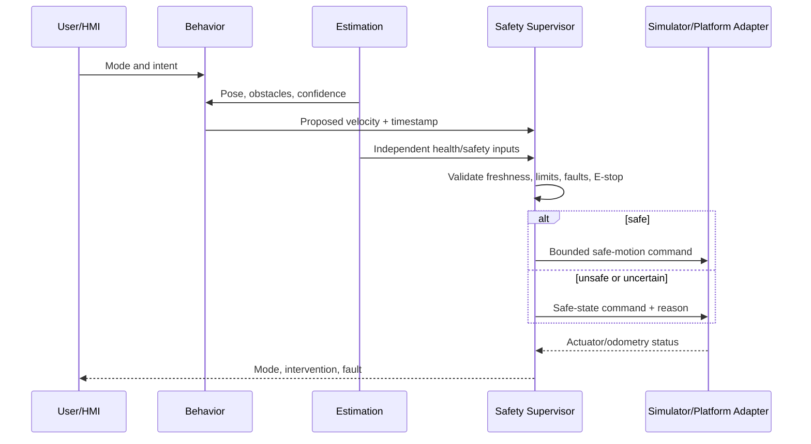

# Data Flow

Status: Proposed
Owner: Architecture Workstream
Last Updated: 2026-08-23
Related Issues: TBD
Related ADRs: ADR-0008

Logs must avoid personal data by default and preserve enough timestamps and configuration identifiers to reproduce results.
