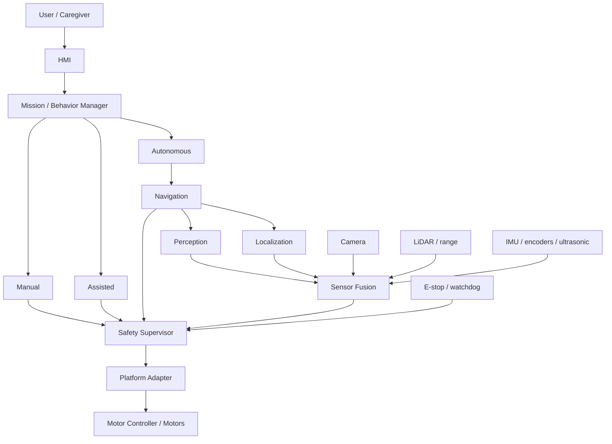

# High-Level Architecture

Status: Proposed
Owner: Architecture Workstream
Last Updated: 2026-08-23
Related Issues: TBD
Related ADRs: ADR-0004, ADR-0008

The safety supervisor is the only path to physical actuation. Higher-level components propose commands; they do not own final motion authority. Exact component boundaries remain subject to ADR review.
