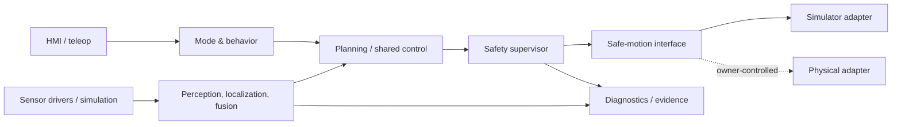

# Software Architecture

Status: Proposed
Owner: ROS 2 Workstream
Last Updated: 2026-08-23
Related Issues: TBD
Related ADRs: ADR-0002, ADR-0006

Packages should have narrow interfaces, deterministic tests, health reporting, explicit time bases, configurable parameters, and mockable hardware boundaries. C++ is expected for time-critical runtime components and Python for tools and experiments, subject to ADRs.
