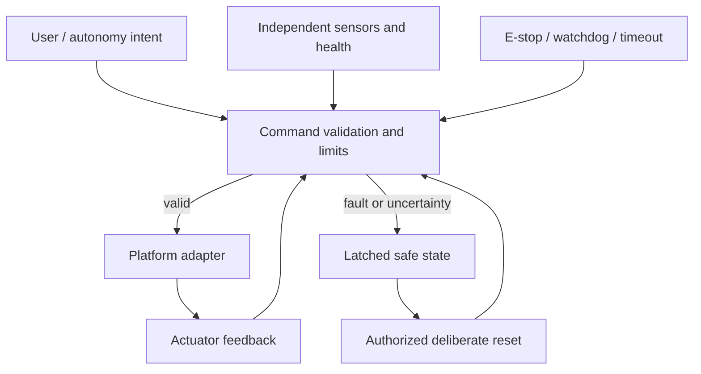

# Safety Philosophy

Status: Preliminary
Owner: Safety Workstream
Last Updated: 2026-08-23
Related Issues: CARE-035
Related ADRs: ADR-0004

Safety is a system property supported by requirements, independent controls, conservative defaults, fault detection, traceability, review, and evidence. Prefer eliminating hazards, then engineered protection, then warnings. No single AI model, sensor, process, network link, or application node should be able to create uncontrolled motion.

