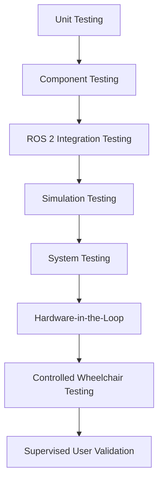

# Testing Strategy

Status: Proposed
Owner: Testing Workstream
Last Updated: 2026-08-23
Related Issues: CARE-040 through CARE-042
Related ADRs: TBD

Each level has distinct assumptions and evidence. Higher levels supplement rather than replace lower levels. Hardware and human testing require separate protocols, approvals, stop criteria, observers, and records; they are never treated as equivalent to simulation.
