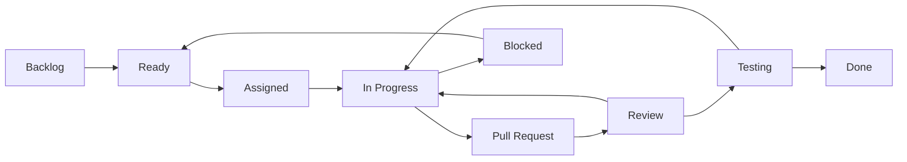

# Issue Workflow

Status: Draft
Owner: Project Maintainer
Last Updated: 2026-08-23
Related Issues: TBD
Related ADRs: TBD

An issue becomes Ready only when scope, deliverable, acceptance criteria, dependencies, hardware need, safety class, workstream, and owner/mentor are clear. Status comes from the GitHub Project; avoid duplicating it in comments. Close only after merge and evidence.
